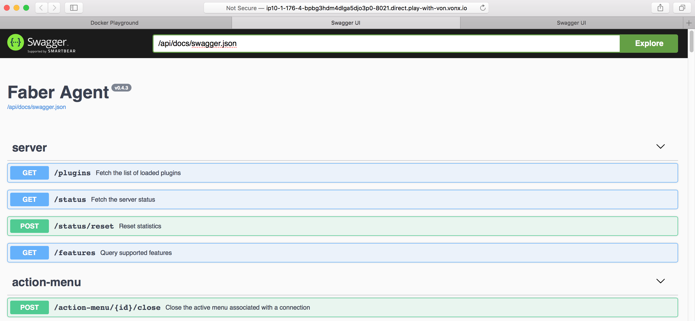
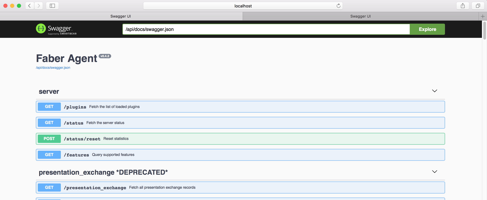
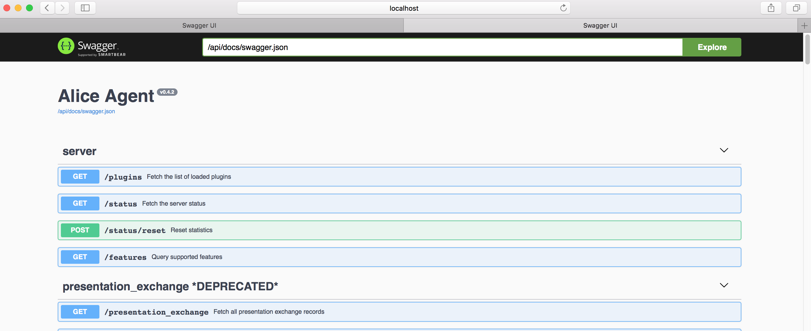
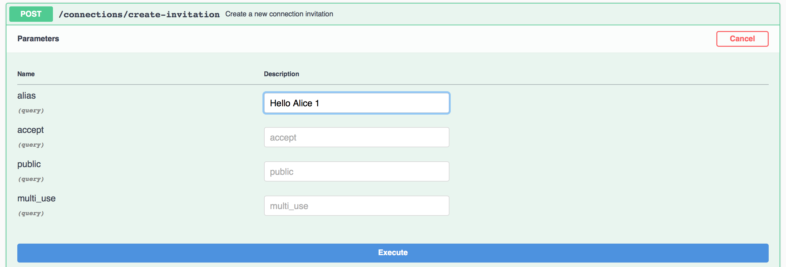
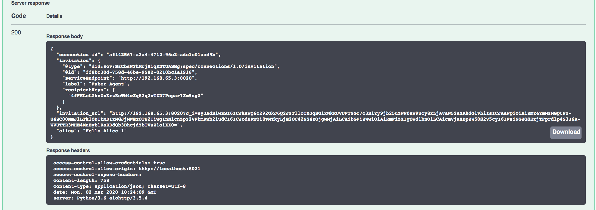
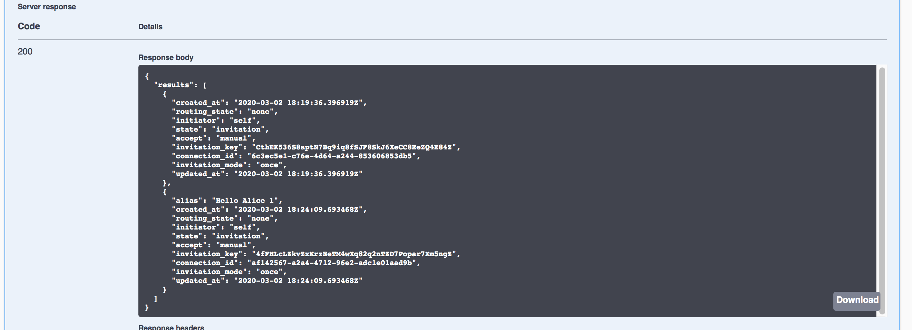
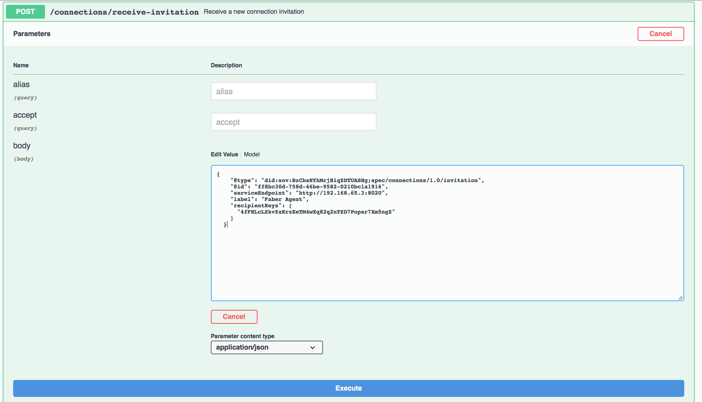
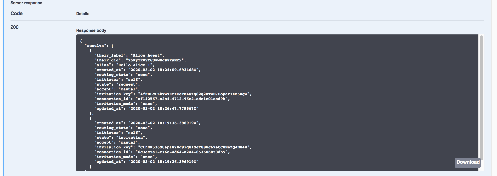
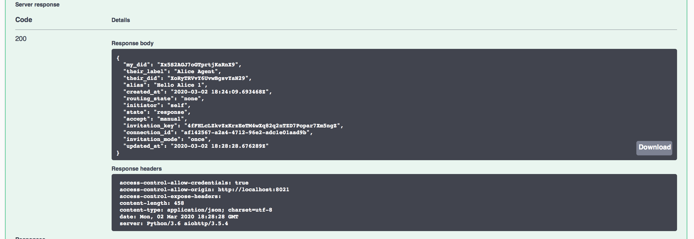

<!----- Conversion time: 3.631 seconds.

Source doc: https://docs.google.com/a/cloudcompass.ca/open?id=12N1KDm1l4Az6bSOJ3DVnBs4HC3_TWz9VpIQ6WTEeykw

----->

# Aries OpenAPI Demo <!-- omit in toc -->

What better way to learn about controllers than by actually being one yourself! In this demo, that’s just what happens&mdash;you are the controller. You have access to the full set of API endpoints exposed by an ACA-Py instance, and you will see the events coming from ACA-Py as they happen. Using that information, you'll help Alice's and Faber's agents connect, Faber's agent issue an education credential to Alice, and then ask Alice to prove she possesses the credential. Who knows why Faber needs to get the proof, but it lets us show off more protocols.

# Contents <!-- omit in toc -->

- [Getting Started](#getting-started)
- [Running in a Browser](#running-in-a-browser)
- [Running in Docker](#running-in-docker)
  - [Restarting the Docker Containers](#restarting-the-docker-containers)
- [Using the OpenAPI/Swagger User Interface](#using-the-openapiswagger-user-interface)
- [Establishing a Connection](#establishing-a-connection)
- [Preparing to Issue a Credential](#preparing-to-issue-a-credential)
  - [Notes](#notes)
- [Issuing a Credential](#issuing-a-credential)
  - [Notes](#notes-1)
  - [Bonus Points](#bonus-points)
- [Requesting/Presenting a Proof](#requestingpresenting-a-proof)
  - [Notes](#notes-2)
- [Conclusion](#conclusion)

## Getting Started

We will get started by opening three browser tabs that will be used throughout the lab. Two will be Swagger UIs for the Faber and Alice agent and one for the public ledger (showing the Hyperledger Indy ledger). As well, we'll keep the terminal sessions where we started the demos handy, as we'll be grabbing information from them as well.

Let's start with the ledger browser. For this demo, we're going to use an open public ledger operated by the BC Government's VON Team. In your first browser tab, go to: [http://dev.greenlight.bcovrin.vonx.io](http://dev.greenlight.bcovrin.vonx.io). This will be called the "ledger tab" in the instructions below.

For the rest of the set up, you can choose to run the terminal sessions in your browser (no local resources needed), or you can run it in Docker on your local system. Your choice, each is covered in the next two sections.

> Note: In the following, when we start the agents we use several special demo settings. The command we use is this: `LEDGER_URL=http://dev.greenlight.bcovrin.vonx.io ./run_demo faber --events --no-auto`. In that:
> 
> - The `LEDGER_URL` environment variable informs the agent what ledger to use.
> - The `--events` option indicates that we want the controller to display the webhook events from ACA-Py in the log displayed on the terminal.
> - The `--no-auto` option indicates that we don't want the ACA-Py agent to automatically handle some events such as connecting. We want the controller (you!) to handle each step of the protocol.

## Running in a Browser

To run the necessary terminal sessions in your browser, go to the Docker playground service [Play with Docker](https://labs.play-with-docker.com/). Don't know about Play with Docker? Check [this out](https://github.com/cloudcompass/ToIPLabs/blob/master/docs/LFS173x/RunningLabs.md#running-on-play-with-docker) to learn more.

### Start the Faber Agent

In a browser, go to the [Play with Docker](https://labs.play-with-docker.com/) home page, Login (if necessary) and click "Start." On the next screen, click (in the left menu) "+Add a new instance."  That will start up a terminal in your browser. Run the following commands to start the Faber agent.

```bash
git clone https://github.com/hyperledger/aries-cloudagent-python
cd aries-cloudagent-python/demo
LEDGER_URL=http://dev.greenlight.bcovrin.vonx.io ./run_demo faber --events --no-auto
```

Once the Faber agent has started up (with the invite displayed), click the link near the top of the screen `8021`. That will start an instance of the OpenAPI/Swagger user interface connected to the Faber instance. Note that the URL on the OpenAPI/Swagger instance is: `http://ip....8021.direct...`.

**Remember that the OpenAPI/Swagger browser tab with an address containing 8021 is the Faber agent.**



### Start the Alice Agent

Now to start Alice's agent. Click the "+Add a new instance" button again to open another terminal session. Run the following commands to start Alice's agent:

```bash
git clone https://github.com/hyperledger/aries-cloudagent-python
cd aries-cloudagent-python/demo
LEDGER_URL=http://dev.greenlight.bcovrin.vonx.io ./run_demo alice --events --no-auto
```

Once the Alice agent has started up (with the `invite:` prompt displayed), click the link near the top of the screen `8031`. That will start an instance of the OpenAPI/Swagger User Interface connected to the Alice instance. Note that the URL on the OpenAPI/Swagger instance is: `http://ip....8031.direct...`.

**Remember that the OpenAPI/Swagger browser tab with an address containing 8031 is Alice's agent.**


You are ready to go. Skip down to the [Using the OpenAPI/Swagger User Interface](#using-the-openapiswagger-user-interface) section.

## Running in Docker

To run the demo on your local system, you must have git, a running Docker installation, and terminal windows running bash. Need more information about getting set up? Click [here](https://github.com/cloudcompass/ToIPLabs/blob/master/docs/LFS173x/RunningLabs.md#running-on-docker-locally) to learn more.

### Start the Faber Agent

To begin running the demo in Docker, open up two terminal windows, one each for the Faber’s and Alice’s agent.

In the first terminal window, clone the ACA-Py repo, change into the demo folder and start the Faber agent:

```bash
git clone https://github.com/hyperledger/aries-cloudagent-python
cd aries-cloudagent-python/demo
LEDGER_URL=http://dev.greenlight.bcovrin.vonx.io ./run_demo faber --events --no-auto
```

If all goes well, the agent will show a message indicating it is running. Use the second browser tab to navigate to [http://localhost:8021](http://localhost:8021). You should see an OpenAPI/Swagger user interface with a (long-ish) list of API endpoints. These are the endpoints exposed by the Faber agent.

**Remember that the OpenAPI/Swagger browser tab with an address containing 8021 is the Faber agent.**



### Start the Alice Agent

To start Alice's agent, open up a second terminal window and in it, change to the same `demo` directory as where Faber's agent was started above. Once there, start Alice's agent:

``` bash
LEDGER_URL=http://dev.greenlight.bcovrin.vonx.io ./run_demo alice --events --no-auto
```

If all goes well, the agent will show a message indicating it is running. Open a third browser tab and navigate to [http://localhost:8031](http://localhost:8031). Again, you should see the OpenAPI/Swagger user interface with a list of API endpoints, this time the endpoints for Alice’s agent.

**Remember that the OpenAPI/Swagger browser tab with an address containing 8031 is Alice's agent.**



### Restarting the Docker Containers

When you are done, or to stop the demo so you can restart it, hit Ctrl-C in the Faber and Alice agent terminal windows to terminate the agents.

## Using the OpenAPI/Swagger User Interface

You should configure your screen to be able to see both the Alice and Faber OpenAPI/Swagger tabs, and both (Alice and Faber) terminal sessions at the same time. After you execute an API call in one of the browsers, you will see a webhook event from the ACA-Py instance in the terminal window of the other agent. That's a controller's life. See an event, process it, send a response.

From time to time you will want to see what's happening on the ledger, so keep that handy as well. As well, if you make an error with one of the commands (e.g. bad data, improperly structured JSON), you will see the errors in the terminals.

In the instructions that follow, we’ll let you know if you need to be in the Faber, Alice or Indy browser tab. We’ll leave it to you to track which is which.

Using the OpenAPI/Swagger user interface is pretty simple. In the steps below, we’ll indicate what API endpoint you need use, such as **`POST /connections/create-invitation`**. That means you must:

1. scroll to and find that endpoint;
2. click on the endpoint name to expand its section of the UI;
3. click on the `Try it out` button;
4. fill in any data necessary to run the command;
5. click `Execute`;
6. check the response to see if the request worked.

So, the mechanical steps are easy. It’s fourth step from the list above that can be tricky. Supplying the right data and, where JSON is involved, getting the syntax correct - braces and quotes can be a pain. When steps don’t work, start your debugging by looking at your JSON.

Enough with the preliminaries, let’s get started!

## Establishing a Connection

We’ll start the demo by establishing a connection between the Alice and Faber agents. We’re starting there to demonstrate that you can use agents without having a ledger. We won’t be using the Indy public ledger at all for this step. Since the agents communicate using DIDcomm messaging and connect by exchanging pairwise DIDs and DIDDocs based on (an early version of) the `did:peer` DID method, a public ledger is not needed.

### Use the Faber Agent to Create an Invitation

In the Faber browser tab, execute the **`POST /connections/create-invitation`** endpoint. No input data is needed to be added for this call. If successful, you should see a connection ID, an invitation, and the invitation URL. The IDs will be different on each run.

**Hint: set an Alias on the Invitation, this makes it easier to find the Connection later on**




### Copy the Invitation created by the Faber Agent

Copy the entire block of the `invitation` object, from the curly brackets `{}`, excluding the trailing comma.



Before switching over to the Alice browser tab, scroll to and execute  the **`GET /connections`** endpoint to see the list of Faber's connections. You should see a connection with a `connection_id` that is identical to the invitation you just created, and that its state is `invitation`.



### Use the Alice Agent to Receive Faber's Invitation

Switch to the Alice browser tab and get ready to execute the **`POST /connections/receive-invitation`** endpoint. Select all of the pre-populated text and replace it with the invitation object from the Faber tab. When you click `Execute` you should get back a connection response with a connection ID, an invitation key, and the state of the connection, which should be `request`.

**Hint: set an Alias on the Invitation, this makes it easier to find the Connection later on**




> A key observation to make here. The "copy and paste" we are doing here from Faber's agent to Alice's agent is what is called an "out of band" message. Because we don't yet have a DIDComm connection between the two agents, we have to convey the invitation in plaintext (we can't encrypt it - no channel) using some other mechanism than DIDComm. With mobile agents, that's where QR codes often come in. Once we have the invitation in the receivers agent, we can get back to using DIDComm.

The connection response returned from the previous **`POST /connections/receive-invitation`** endpoint call will currently show a connection state of `invitation` rather than `request`.

### Tell Alice's Agent to *Accept* the Invitation

At this point Alice has simply stored the invitation in her wallet. To complete a connection with Faber, she must accept the invitation and send a corresponding connection request to Faber. Find the `connection_id` in the connection response from the previous **`POST /connections/receive-invitation`** endpoint call. Scroll to the **`POST /connections/{id}/accept-invitation`** endpoint and paste the `connection_id` in the `id` parameter field (you will have to click the `Try it out` button to see the available URL parameters). The response from clicking `Execute` should show that the connection has a state of `request`.


### Review Faber's Connection Status

Switch over to the Faber broswer tab, scroll to and execute the **`GET /connections`** endpoint. Note the connection that was previously created. It's state is now `request`, which indicates that Alice has accepted the invitation and has sent a corresponding connection request to Faber. Copy the `connection_id` for the next step.



### Tell the Faber Agent to Accept the Connection Request from Alice

To complete the connection process, Faber will respond to the connection request from Alice. Scroll to the **`POST /connections/{id}/accept-request`** endpint and paste the `connection_id` you previously copied into the `id` parameter field (you will have to click the `Try it out` button to see the available URL parameters). The response from clicking the `Execute` button should show that the connection has a state of `response`, which indicates that Faber has accepted Alice's connection request.


### Review the Connection Status in Alice's Agent

Switch over the the Alice browser tab.

Scroll to and execute **`GET /connections`** to see a list of Alice's connections, and the information tracked about each connection. You should see the one connection Alice’s agent has, that it is with the Faber agent, and that its state is `active`.

<<TODO Alice connection state>>

### Review the Connection Status in Faber's Agent

You are connected! Switch to the Faber browser tab and run the same **`GET /connections`** endpoint to see Faber's view of the connection. Its state is also `active`. Note the `connection_id`, you’ll need it later in the tutorial.



## Basic Messaging Between Agents

Once you have a connection between two agents, you have a channel to exchange secure, encrypted messsages. In fact these basic messages are the foundation of all other protocols, such as issuing Credentials and providing Proofs. So, let's send a couple of messages.

### Sending a message from Alice to Faber

In Alice's swagger page, scroll to the **`POST /connections/{id}/send-message`** endpoint.  Click on `Try it Out` and enter a message in the body provided (for example `{"content": "Hello Faber"}`).  Enter the connection id of Alice's connection in the field provided.  Then click on `Execute`.

<<TODO Picture of Alice's screen>>

### Receiving a Basic Message (Faber)

How does Faber know that a message was sent? If you take a look at Faber's console window, you can see that Faber's agent has raised an Event that the message was received:

<<TODO picture of Faber's console window>>

Faber's controller application can take whatever action is necessary to process this message. It could trigger some applicaiton code, or it might just be something the Faber application needs to display to its user (for example a reminder about some action the user needs to take).

### Alice Agent Verifies that Faber has Received the Message

How does Alice get feedback that Faber has received the message? The same way - when Faber's agent acknowledges receipt of the message, Alice's agent raises an Event to let the Alice controller know:

<<TODO picture of Alice's console window>>

Again, Alice's agent can take whatever action is necessary, possibly just flagging the message as having been `received`.

## Preparing to Issue a Credential

The next thing we want to do in the demo is have the Faber agent issue a credential to Alice’s agent. To this point, we have not used the Indy ledger at all. Establishing the connection and all the messaging has been done with pairwise DIDs based on the `did:peer` method. Verifiable credentials must be rooted in a public DID ledger to enable the presentation of proofs.

Before the Faber agent can issue a credential, it must register a DID on the Indy public ledger, publish a schema, and create a credential definition. In the “real world”, the Faber agent would do this before connecting with any other agents. And, since we are using the handy "./run_demo faber" (and "./run_demo alice") scripts to start up our agents, the Faber version of the script has already:

1. registered a public DID and stored it on the ledger;
2. created a schema and registered it on the ledger;
3. created a credential definition and registered it on the ledger.

The schema and credential definition could also be created through this swagger interface.

### Confirming your Schema and Credential Definition

You can confirm the schema and credential definition were published by going back to the Indy ledger browser tab.

First confirm the DID you used to write to the ledger. Open Faber's swagger page and scroll to the **`GET /wallet/did/public`** endpoint.  Click on `Try it Out` and `Execute` and you will see your public DID.

<<TODO screenshot of the DID>>

On the BCovrin ledger browser, view the `Domain` page, refresh, and paste your DID into the `Filter:` field:

<<TODO show filter>>

The ledger browser whould refresh and display the four (4) transactions on the ledger related to this DID:

- the initial DID registration
- registration of the DID endpoint (Faber is an issuer so it has a public endpoint)
- the registered schema
- the registered credential definition

<<TODO show a screen shot of the BCovrin ledger browser>>

You can also look up the Schema and Credential Definition information using Faber's swagger page.

You can use the **`GET /schemas/created`** endpoint to get a list of schema id's created by this agent, and then **`GET /schemas/{id}`** to get details on a specific schema.

Likewise you can use the **`GET /credential-definitions/created`** endpoint ot get a list of credential definition id's, and then use the **`GET /credential-definitions/{id}`** endpoint to get informaiton on a specific credential definition.

Either way, you will need information on the schema and credential definition in order to issue a Credential, which is what we will do next!

(You can use the **`POST`** endpoints to create a new schema and credential definition if you like.)

### Notes

The one time setup work for issuing a credential complete. We can now issue 1 or a million credentials without having to do those steps again. Astute readers might note that we did not setup a revocation registry, so we cannot revoke the credentials we issue with that credential definition. You can’t have everything in an easy demo (and we’re still working on enabling that).

## Issuing a Credential

Issuing a credential from the Faber agent to Alice’s agent is done with another API call. In the Faber browser tab, scroll down to the **`POST /issue-credential/send`** and get ready to (but don’t yet) execute the request. Before execution, you need to find some other data to complete the JSON. Keep a notepad ready to copy the data you find.

### Faber - Preparing to Issue a Credential

First, scroll back up to the **`GET /connections`** API endpoint and execute it. From the result, find the the `connection_id` and copy the value. 

<details>
    <summary>Click here to see a screenshot</summary>
    
</details>

A little trickier to find is the `cred_def_id`. Go back to the terminal where you started the Faber agent, and scroll back until you see the text `#3/4 Create a new schema/cred def on the ledger` and then just below that `Cred def ID:`. Copy the text following that label. While you are at it, copy the text following the label `Schema ID:` as well. 

<details>
    <summary>Show me a screenshot!</summary>
    
</details>

Note:  Another way to get the `cred_def_id` is to find it by searching the Indy network transactions posted to the ledger browser app. That works well if you are running locally by clicking the `Domain` link and using the search feature. However, that approach is harder to do when running in the browser, because there are many credential definitions on that ledger instance. 

Now scroll up the terminal till you see the text `#1 Provision an agent and wallet, get back configuration details`. Below that you see `Public DID Information:` displayed in the Faber Agent banner. Copy the text after the label `-DID:`. This is the public did of Faber Agent. In our case, its the DID of the schema issuer. 

<details>
    <summary>Show me where I can find the issuer DID</summary>
    
</details>

You'll also need this to track down the schema issued by Faber Agent on the `Domain` ledger. We'll do this next. Go to your ledger URL (It is [http://dev.greenlight.bcovrin.vonx.io](http://dev.greenlight.bcovrin.vonx.io) in case you are running this demo from the browser), refresh the page (important), and in the top right corner, select `Type:` as `SCHEMA`. This will filter out transactions of type `SCHEMA`. Typically there are thousands of them displayed in pages of 10. Go to the last page, scroll down to the end and look for the entry in which the `Signed by:` value in the `Message Wrapper` is the same as the public DID of Faber Agent. From the `Transaction` section of this entry, copy the values of `Schema name:` and `Schema version:` 

<details>
    <summary>Click here to see where you can find schema related information</summary>
    
</details>

We now have (almost) all the information we need to fill in the JSON. The good news is that the hard part is done. 

Use the data that you gathered in the steps above to fill in the vales for `schema_issuer_did:` (the public DID of Faber Agent), `schema_id:` (the text following `Schema ID:` that you scraped off the Faber Agent terminal), `cred_def_id:` (the text following `Cred def ID:` scraped off the Faber Agent terminal), `issuer_did:` (the public DID of Faber Agent), `schema_name` and `schema_version` (values copied from the schema entry of the `Domain` ledger). 

### Faber - Issuing the Credential

Now we need put into the JSON the data values for the credential. Copy and paste the following between the `attributes` square brackets. Feel free to change the attribute values (but neither the labels nor the names) as you see fit:

```
      {
        "name": "name",
        "value": "Alice Smith"
      },
      {
        "name": "date",
        "value": "2018-05-28"
      },
      {
        "name": "degree",
        "value": "Maths"
      },
      {
        "name": "age",
        "value": "24"
      }
```

Ok, finally, you are ready to click `Execute`. The request should work, but if it doesn’t - check your JSON! Did you get all the quotes and commas right?

<<TODO screenshot of the completed JSON>>

To confirm the issuance worked, scroll up to the top of the `v1.0 issue-credential exchange` section and execute the **`GET /issue-credential/records`** endpoint. You should see a lot of information about the exchange, including the state - `credential_acked`.

### Alice Receives Credential

Let’s look at it from Alice’s side. Switch to the Alice’s agent browser tab, find the `credentials` section and within that, execute the **`GET /credentials`** endpoint. There should be a list of credentials held by Alice, with just a single entry, the credential issued from the Faber agent. Note that the element `referent` is the value of the `credential_id` element used in other calls. `referent` is the name returned in the `indy-sdk` call to get the set of credentials for the wallet and ACA-Py code is not changing it in the response.

You’ve done it, issued a credential!  w00t!

### Notes

Those that know something about the Indy process for issuing a credential and the DIDcomm `Issue Credential` protocol know that there a multiple steps to issuing credentials, a back and forth between the Issuer and the Holder to (at least) offer, request and issue the credential. All of those messages happened, but the two agents took care of those details rather than bothering the controller (you, in this case) with managing the back and forth.

* On the Faber agent side, this is because we used the **`POST /issue-credential/send`** administrative message, which handles the back and forth for the issuer automatically. We could have used the other `/issue-credential/` endpoints to allow the controller to handle each step of the protocol.
* On Alice's agent side, this is because in the startup options for the agent, we used the `--auto-respond-credential-offer` and `--auto-store-credential` parameters.

### Review of Console Events

<<TODO review the Alice and Faber Events in their Console Windows>>

### Bonus Points

If you would like to perform all of the issuance steps manually on the Faber agent side, use a sequence of the other `/issue-credential/` messages. Use the **`GET /issue-credential/records`** to both check the credential exchange state as you progress through the protocol and to find some of the data you’ll need in executing the sequence of requests.

<<TODO list the events, and the corresponding API calls to move to the next step>>

## Requesting/Presenting a Proof

Alice now has her Faber credential. Let’s have the Faber agent send a request for a presentation (a proof) using that credential. This should be pretty easy for you at this point.

### Faber sends a Proof Request

From the Faber browser tab, get ready to execute the **`POST /present-proof/send-request`** endpoint. Select the entire pre-populated text and replace it with the following. In doing so, use the techniques we used in issuing the credential to replace the sample values for each instance of `cred_def_id` (there are four) and `connection_id`.

``` JSONC
{
  "connection_id": "3fa85f64-5717-4562-b3fc-2c963f66afa6",
  "proof_request": {
    "name": "Proof of Education",
    "version": "1.0",
    "requested_attributes": {
      "0_name_uuid": {
        "name": "name",
        "restrictions": [
          {
            "cred_def_id": "WgWxqztrNooG92RXvxSTWv:3:CL:20:tag"
          }
        ]
      },
      "0_date_uuid": {
        "name": "date",
        "restrictions": [
          {
            "cred_def_id": "WgWxqztrNooG92RXvxSTWv:3:CL:20:tag"
          }
        ]
      },
      "0_degree_uuid": {
        "name": "degree",
        "restrictions": [
          {
            "cred_def_id": "WgWxqztrNooG92RXvxSTWv:3:CL:20:tag"
          }
        ]
      },
      "0_self_attested_thing_uuid": {
        "name": "self_attested_thing"
      }
    },
    "requested_predicates": {
      "0_age_GE_uuid": {
        "name": "age",
        "p_type": ">=",
        "p_value": 18,
        "restrictions": [
          {
            "cred_def_id": "WgWxqztrNooG92RXvxSTWv:3:CL:20:tag"
          }
        ]
      }
    }
  }
}
```

Notice that the proof request is using a predicate to check if Alice is older than 18 without asking for her age. (Not sure what this has to do with her education level!) Click `Execute` and cross your fingers. If the request fails check your JSON!

### Faber - Verifying the Proof

Note that in the response, the state is `request_sent`. That is because when the HTTP response was generated (immediately after sending the request), Alice’s agent had not yet responded to the request. We’ll have to do another request to verify the presentation worked. Copy the value of the `presentation_exchange_id` field from the response and use it in executing the **`GET /present-proof/records/{pres_ex_id}`** endpoint. That should return a result showing the state as `verified` and `verified` as `true`. Proof positive!

### Notes

As with the issue credential process, the agents handled some of the presentation steps without bothering the controller.  In this case, Alice’s agent processed the presentation request automatically because it was started with the `--auto-respond-presentation-request` parameter set, and her wallet contained exactly one credential that satisfied the presentation-request from the Faber agent. Similarly, the Faber agent was started with the `--auto-verify-presentation` parameter and so on receipt of the presentation, it verified the presentation and updated the status accordingly.

### Review of Console Events

<<TODO review the Alice and Faber Events in their Console Windows>>

### Bonus Points

If you would like to perform all of the proof request/response steps manually ... <TODO>>

<<TODO list the events, and the corresponding API calls to move to the next step>>

## Conclusion

That’s the OpenAPI-based tutorial. Feel free to play with the API and learn how it works. More importantly, as you implement a controller, use the OpenAPI user interface to test out the calls you will be using as you go. The list of API calls is grouped by protocol and if you are familiar with the protocols (Aries RFCs) the API call names should be pretty obvious.

One limitation of you being the controller is that you don't see the events from the agent that a controller program sees. For example, you, as Alice's agent, are not notified when Faber initiates the sending of a Credential. Some of those things show up in the terminal as messages, but others you just have to know have happened based on a successful API call.

<!-- Docs to Markdown version 1.0β17 -->
